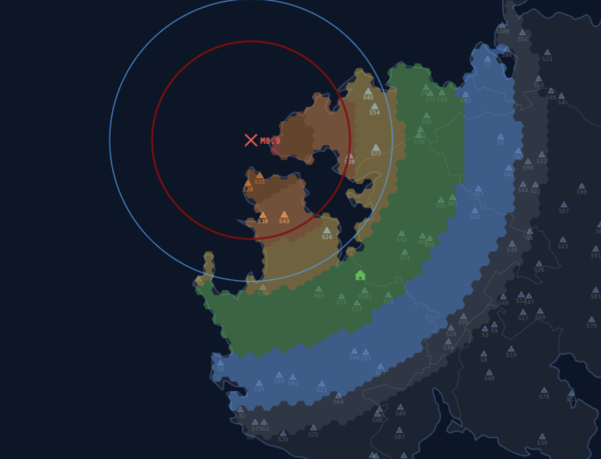

# OQUAKE

An interactive, single-file earthquake simulator set in a custom worldbuilding project. Click anywhere on the map to spawn seismic events, watch P and S waves propagate in real time, and observe shaking intensity, tsunami warnings, and sensor network alerts — all rendered on an HTML5 Canvas with no dependencies.
Inspired by Earthquake Early Warning system in Japan (JQuake)
---

---

## Features

- **Click-to-spawn earthquakes** — place an epicenter anywhere on the Japan outline; configurable magnitude (M1.0–M10.0) and depth (1–120 km)
- **Realistic wave propagation** — separate P-wave and S-wave ripples at physics-based speeds, with magnitude-scaled line widths and fade curves
- **Intensity overlay** — hex-grid shaking intensity map (MMI 1–7) appears after each event; color-coded from blue (weak) to purple (extreme)
- **Foreshock / mainshock / aftershock sequences** — automatic sequence generation with correct temporal and spatial relationships
- **Tsunami warnings** — coast-aware warning system with three severity tiers: Watch, Warning, and Major; coastline highlights update per event
- **Sensor network** — 100 sensors auto-placed on land at startup; add or remove custom sensors via Place Sensors mode; sensors flash and report P-wave detections in real time
- **Home location** — pin your location to receive estimated shaking intensity, distance to epicenter, and live P/S wave arrival countdowns
- **Live event feed** — scrollable sidebar logs every detected event with magnitude, depth, and region
- **Zoom & pan** — scroll-wheel zoom (up to 12×), click-drag panning, and zoom controls
- **Alert panel** — persistent HUD showing current event: location, time, depth, MMI, and foreshock/aftershock context
- **Clear all** — reset the simulation in one click

---

## Try it

A live version is available at the deployment link — no installation needed, just open it in your browser.

---

## Usage

| Action | Result |
|---|---|
| Click on the map | Spawn earthquake at that point |
| Scroll / pinch | Zoom in and out |
| Click + drag | Pan (when zoomed in) |
| Place Sensors → click | Drop a custom sensor |
| ↩ Undo | Remove the last placed sensor |
| ⌂ My Location → click | Pin your home location |
| Magnitude slider | Set M1.0–M10.0 for next event |
| Depth slider | Set 1–120 km for next event |
| Clear all | Reset all events, sensors, and overlays |

---

## Technical Notes

- Rendered entirely on a single `<canvas>` element via `requestAnimationFrame`
- BFS land-mask built from the outline polygon at startup for sensor placement validation
- Intensity values computed from magnitude and distance using a simplified attenuation model
- Wave speeds: P ≈ 0.09 px/frame, S ≈ 0.063 px/frame (scaled to ~700 km map width)
- Tsunami thresholds tied to magnitude and depth; coast segments highlighted per warning level
- No external dependencies — pure HTML, CSS, and vanilla JavaScript

---

## License

MIT
